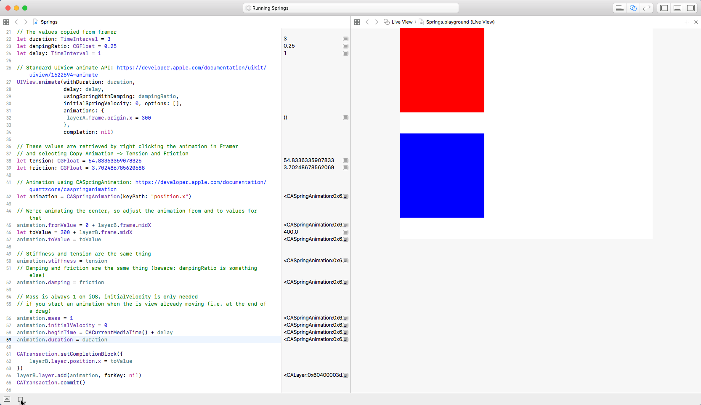

This repository contains a [Framer](https://framer.com) project and an XCode Playground that show how to use Framer Springs in production on iOS.

# Framer Code

```coffee
layerA.animate
	x: 300
	options:
		time: duration
		curve: Spring(damping: 0.25)
		delay: delay
```

# Copy Animation

Right click on the animation and select "Copy Animation" from the context menu.


# UIView.animate

Copy "Damping and Duration"

```swift
// Copy-pasted values
duration = 3
dampingRatio = 0.25

UIView.animate(withDuration: duration,
               delay: delay,
               usingSpringWithDamping: dampingRatio,
               initialSpringVelocity: 0, options: [],
               animations: {
                layerA.frame.origin.x = 300
               },
               completion: nil)
```

[Apple's documentation](https://developer.apple.com/documentation/uikit/uiview/1622594-animate)


# CASpringAnimation

Copy "Tension and Friction"

```swift
// Copy-pasted values
tension = 54.83363359078326
friction = 3.702486785620688


let animation = CASpringAnimation(keyPath: "position.x")

// We're animating the center, so adjust the animation from and to values for that
animation.fromValue = 0 + layerB.frame.midX
let toValue = 300 + layerB.frame.midX
animation.toValue = toValue

// Stiffness and tension are the same thing
animation.stiffness = tension
// Damping and friction are the same thing (beware: dampingRatio is something else)
animation.damping = friction

// Mass is always 1 on iOS, initialVelocity is only needed
// if you start an animation when the is view already moving (i.e. at the end of a drag)
animation.mass = 1
animation.initialVelocity = 0
animation.beginTime = CACurrentMediaTime() + delay
animation.duration = animation.settlingDuration

CATransaction.setCompletionBlock({
    layerB.layer.position.x = toValue
})
layerB.layer.add(animation, forKey: nil)
CATransaction.commit()
```

[Apple's documentation](https://developer.apple.com/documentation/quartzcore/caspringanimation)


# Sidenote

[This article](https://medium.com/@flyosity/your-spring-animations-are-bad-and-it-s-probably-apple-s-fault-784932e51733) about springs on iOS is mostly wrong, in that it assumes that adding a duration to a spring leads to non-natural springs, but under the hood, iOS computes the actual tension and friction for the spring simulation based on dampingRatio and duration. The same [calculations](https://github.com/koenbok/Framer/blob/master/framer/Animators/SpringCurveValueConverter.coffee) are used in Framer to convert these values.

As you can see in the animation below, the same spring animation is created, regardless of which animation API is used:


